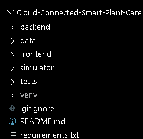
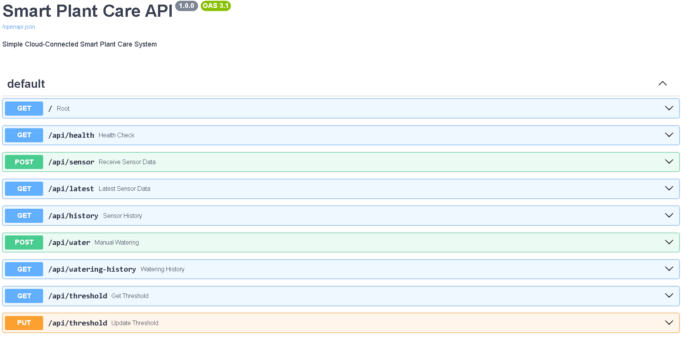
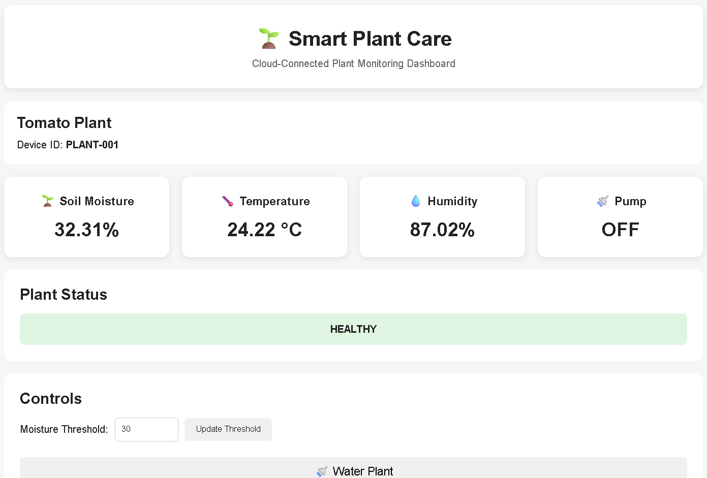
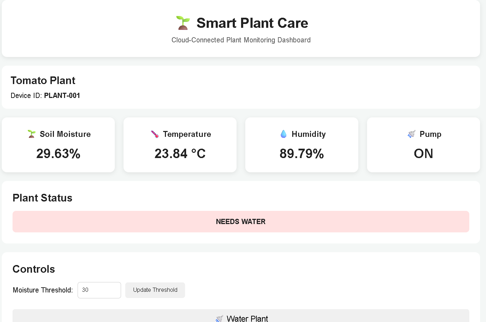
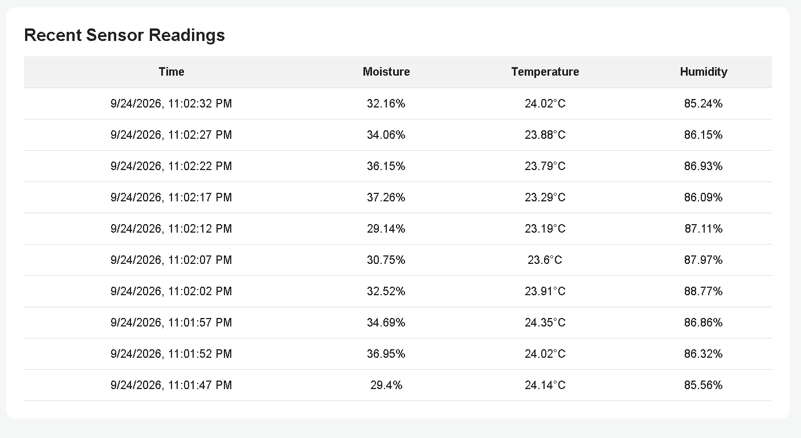

# 🌱 Cloud-Connected Smart Plant Care

A beginner-friendly **IoT and Cloud Computing project** that simulates a smart plant monitoring and automatic watering system using **Python, FastAPI, SQLite, REST APIs, and a web dashboard**.

The system continuously receives virtual sensor readings such as **soil moisture, temperature, and humidity**, stores the data in a local database, monitors the plant condition, and automatically activates virtual watering when the soil moisture falls below a configurable threshold.

This project demonstrates how an IoT device can collect sensor data, communicate with a backend service, store data, apply automation logic, and present the information through a web dashboard.

---

## 👨‍💻 Author

**Vayunandan Mishra**  
ECE Student | Cloud Computing | IoT | Python

GitHub:  
https://github.com/Vayu-143

Project Repository:  
https://github.com/Vayu-143/Cloud-Connected-Smart-Plant-Care

---

## 📌 Project Overview

Traditional plant watering depends on manual monitoring. Plants may receive too much or too little water when soil conditions are not checked regularly.

The **Cloud-Connected Smart Plant Care** system provides a simple automated solution.

The project simulates an IoT-based plant monitoring device that:

- Collects soil moisture readings
- Monitors temperature
- Monitors humidity
- Sends sensor data to a FastAPI backend
- Stores sensor information using SQLite
- Displays live plant information on a web dashboard
- Detects low soil moisture
- Automatically activates virtual watering
- Records watering events
- Allows manual watering
- Maintains sensor and watering history
- Allows the moisture threshold to be configured

The project uses a **virtual IoT sensor simulator**, so physical hardware is not required.

---

## 🎯 Objectives

The main objectives of this project are:

- Build a simple IoT-based plant monitoring system
- Simulate real-world sensor data using Python
- Develop a REST API using FastAPI
- Store sensor information using SQLite
- Implement threshold-based automation
- Create a web-based monitoring dashboard
- Demonstrate automatic watering logic
- Maintain sensor and watering history
- Understand the relationship between IoT devices, backend APIs, databases, and cloud-based systems
- Create an industry-oriented project suitable for an ECE and Cloud Computing portfolio

---

## 🚀 Key Features

### 🌱 IoT Sensor Simulation

The Python simulator generates virtual sensor readings for:

- Soil Moisture
- Temperature
- Humidity
- Device ID
- Timestamp

The simulator produces changing values instead of completely random readings.

Soil moisture gradually decreases over time, representing natural water consumption by the plant.

Temperature and humidity also change gradually to provide more realistic sensor behavior.

---

### 💧 Automatic Watering

The system continuously monitors soil moisture.

When:

```text
Soil Moisture < Configured Threshold
```

the backend activates the virtual watering system.

Example:

```text
Soil Moisture = 27%
Threshold = 30%

Result:
Plant needs water
Automatic watering activated
```

After watering, the simulator increases the soil moisture level.

Example:

```text
Before Watering: 27%
After Watering: 55%
```

The plant can then return to a healthy state.

---

### 🖐️ Manual Watering

The dashboard provides an option to manually activate watering.

This allows the user to test the watering functionality without waiting for the moisture level to fall below the configured threshold.

---

### ⚙️ Configurable Moisture Threshold

The moisture threshold can be viewed and updated through the API.

Example:

```text
Threshold = 30%
```

If soil moisture falls below `30%`, automatic watering is triggered.

The threshold can be changed according to the plant's requirements.

---

### 📊 Web Dashboard

The frontend provides a simple monitoring dashboard showing:

- Soil Moisture
- Temperature
- Humidity
- Pump Status
- Plant Status
- Moisture Threshold
- Sensor History
- Watering History
- Manual Watering Control

Example dashboard values:

```text
Soil Moisture: 37.2%
Temperature: 27.33 °C
Humidity: 63.46%
Pump: OFF
Plant Status: HEALTHY
Threshold: 30%
```

---

### 🗄️ SQLite Database

The backend stores sensor and watering information in a local SQLite database.

The database provides persistent storage for:

- Sensor readings
- Timestamps
- Device information
- Watering events
- Watering status
- Moisture values

The database file is generated locally and is excluded from GitHub using `.gitignore`.

---

### 📜 Sensor History

The system stores historical sensor readings.

This allows the dashboard/API to retrieve previous values and observe how environmental conditions change over time.

---

### 💦 Watering History

Every watering event can be recorded and retrieved.

The watering history can contain information such as:

- Watering type
- Timestamp
- Soil moisture before watering
- Soil moisture after watering
- Watering status

---

### 🔌 REST API

The FastAPI backend provides REST API endpoints for communication between the simulator, dashboard, and database.

The API supports:

- Sensor data submission
- Latest sensor reading
- Sensor history
- Manual watering
- Watering history
- Moisture threshold retrieval
- Moisture threshold update
- Automatic watering logic

---

## ☁️ Cloud Computing Relevance

Although the current implementation runs locally, the architecture follows a cloud-connected IoT model.

The project demonstrates the basic cloud/IoT data flow:

```text
Virtual IoT Sensor
       ↓
REST API
       ↓
Backend Processing
       ↓
Database
       ↓
Web Dashboard
       ↓
User
```

In a real cloud deployment, the local components can be replaced or extended with:

```text
Real IoT Sensors
       ↓
Internet / MQTT / HTTP
       ↓
Cloud API
       ↓
Cloud Database
       ↓
Cloud Dashboard
       ↓
User
```

Possible cloud platforms for future deployment include:

- AWS
- Microsoft Azure
- Google Cloud
- Render
- Railway
- Other cloud hosting platforms

---

## 🏗️ System Architecture

```text
                 ┌──────────────────────────┐
                 │     Virtual IoT Sensor   │
                 │      Python Simulator    │
                 └────────────┬─────────────┘
                              │
                              │ HTTP POST
                              ▼
                 ┌──────────────────────────┐
                 │      FastAPI Backend     │
                 │                          │
                 │ • REST API               │
                 │ • Sensor Processing      │
                 │ • Watering Logic         │
                 │ • Threshold Management   │
                 └────────────┬─────────────┘
                              │
                              ▼
                 ┌──────────────────────────┐
                 │      SQLite Database     │
                 │                          │
                 │ • Sensor History         │
                 │ • Watering History       │
                 └────────────┬─────────────┘
                              │
                              │ API Requests
                              ▼
                 ┌──────────────────────────┐
                 │      Web Dashboard       │
                 │     HTML/CSS/JavaScript  │
                 └────────────┬─────────────┘
                              │
                              ▼
                           User
```

---

## 🔄 Data Flow

The complete data flow is:

```text
1. Python simulator generates sensor values
                    ↓
2. Simulator sends values to FastAPI
                    ↓
3. FastAPI validates and processes the data
                    ↓
4. Sensor data is stored in SQLite
                    ↓
5. Backend checks soil moisture threshold
                    ↓
6. If moisture is below threshold,
   automatic watering is activated
                    ↓
7. Simulator increases virtual soil moisture
                    ↓
8. Updated values are stored
                    ↓
9. Dashboard retrieves the latest information
                    ↓
10. User monitors plant condition
```

---

## 🧠 Automatic Watering Logic

The automatic watering system uses a simple threshold-based algorithm.

```text
Read Soil Moisture
        ↓
Compare with Threshold
        ↓
Is Moisture < Threshold?
       / \
     Yes  No
      ↓    ↓
 Activate  Continue
 Watering  Monitoring
      ↓
Increase Simulated
Soil Moisture
      ↓
Store Watering Event
      ↓
Plant Returns to
Healthy Condition
```

Example:

```text
Threshold = 30%

Moisture = 45%
→ Plant Healthy
→ Pump OFF

Moisture = 35%
→ Plant Healthy
→ Pump OFF

Moisture = 28%
→ Low Moisture
→ Pump ON

After Watering
→ Moisture increases
→ Pump OFF
→ Plant Healthy
```

---

## 🌡️ Plant Status Logic

The system uses the configured soil moisture threshold to determine plant condition.

Example:

```text
Soil Moisture >= Threshold
        ↓
Plant Healthy

Soil Moisture < Threshold
        ↓
Plant Needs Water
        ↓
Automatic Watering
```

This provides a simple and understandable automation model.

---

## 🛠️ Technologies Used

### Backend

- Python
- FastAPI
- REST API
- SQLite
- Uvicorn

### Frontend

- HTML5
- CSS3
- JavaScript

### IoT Simulation

- Python
- Requests
- Virtual sensor values

### Database

- SQLite

### Testing

- Pytest

### Development Tools

- Visual Studio Code
- Git
- GitHub
- FastAPI Swagger UI

---

## 📁 Project Structure

```text
Cloud-Connected-Smart-Plant-Care/
│
├── backend/
│   ├── __init__.py
│   ├── app.py
│   ├── database.py
│   └── watering.py
│
├── data/
│   └── plant.db
│
├── frontend/
│   ├── index.html
│   ├── script.js
│   └── style.css
│
├── simulator/
│   └── simulator.py
│
├── tests/
│   └── test_api.py
│
├── screenshots/
│   ├── automatic_watering.png
│   ├── fastapi_swagger.png
│   ├── healthy_plant.png
│   ├── project_structure.png
│   └── watering_history.png
│
├── requirements.txt
├── .gitignore
└── README.md
```

---

## 📂 Folder Description

### `backend/`

Contains the FastAPI backend and application logic.

### `app.py`

Main FastAPI application containing REST API routes and system logic.

### `database.py`

Handles SQLite database operations.

### `watering.py`

Contains watering-related logic.

### `frontend/`

Contains the web dashboard.

### `index.html`

Dashboard structure and UI elements.

### `script.js`

Handles API communication and dashboard updates.

### `style.css`

Controls the dashboard appearance.

### `simulator/`

Contains the virtual IoT sensor simulator.

### `simulator.py`

Generates changing sensor readings and sends them to the FastAPI backend.

### `tests/`

Contains automated API tests.

### `test_api.py`

Tests important backend functionality.

### `data/`

Stores the local SQLite database.

### `screenshots/`

Contains project screenshots used for documentation.

---

## ⚙️ Installation

### 1. Clone the Repository

```bash
git clone https://github.com/Vayu-143/Cloud-Connected-Smart-Plant-Care.git
cd Cloud-Connected-Smart-Plant-Care
```

---

## 🐍 2. Create a Virtual Environment

Windows:

```powershell
python -m venv venv
```

Activate it:

```powershell
venv\Scripts\activate
```

If PowerShell blocks activation, use:

```powershell
Set-ExecutionPolicy -ExecutionPolicy RemoteSigned -Scope CurrentUser
```

Then activate again:

```powershell
venv\Scripts\activate
```

---

## 📦 3. Install Dependencies

```powershell
pip install -r requirements.txt
```

---

## 🚀 4. Start the FastAPI Backend

From the project root:

```powershell
uvicorn backend.app:app --reload
```

Backend:

```text
http://127.0.0.1:8000
```

---

## 📚 5. Open Swagger API Documentation

Open:

```text
http://127.0.0.1:8000/docs
```

FastAPI automatically provides interactive API documentation.

You can use Swagger to:

- View API endpoints
- Test API requests
- Submit sensor data
- Check sensor history
- Trigger watering
- View watering history
- View threshold
- Update threshold

---

## 🌱 6. Start the IoT Simulator

Open another VS Code terminal.

Activate the environment:

```powershell
venv\Scripts\activate
```

Run:

```powershell
python simulator/simulator.py
```

The simulator continuously generates virtual sensor readings and sends them to the backend.

The soil moisture gradually decreases.

When it falls below the configured threshold, automatic watering is triggered.

After watering, the simulated soil moisture increases.

---

## 🌐 7. Start the Frontend

Open another terminal.

Navigate to the frontend folder:

```powershell
cd frontend
```

Open `index.html` using the VS Code Live Server extension.

The dashboard will normally be available at:

```text
http://127.0.0.1:5500
```

---

## 🖥️ Running the Complete Project

Three components should run during the demonstration.

### Terminal 1 — FastAPI Backend

```powershell
uvicorn backend.app:app --reload
```

### Terminal 2 — IoT Simulator

```powershell
python simulator/simulator.py
```

### Browser — Frontend Dashboard

```text
http://127.0.0.1:5500
```

Swagger:

```text
http://127.0.0.1:8000/docs
```

---

## 📊 Dashboard

The dashboard provides a simple interface for monitoring the virtual plant.

It displays:

- Soil Moisture
- Temperature
- Humidity
- Pump Status
- Plant Status
- Moisture Threshold
- Sensor History
- Watering History
- Manual Watering Control

Example:

```text
┌─────────────────────────────────────┐
│       SMART PLANT CARE              │
├─────────────────────────────────────┤
│ Soil Moisture      37.2%             │
│ Temperature        27.33 °C          │
│ Humidity           63.46%            │
│ Pump Status        OFF               │
│ Plant Status       HEALTHY           │
│ Moisture Threshold 30%              │
└─────────────────────────────────────┘
```

---

## 💧 Automatic Watering Demonstration

### Step 1

Start the FastAPI backend:

```powershell
uvicorn backend.app:app --reload
```

### Step 2

Start the simulator:

```powershell
python simulator/simulator.py
```

### Step 3

Open the dashboard:

```text
http://127.0.0.1:5500
```

### Step 4

Observe the soil moisture.

Initially:

```text
Soil Moisture: 50%+
Pump: OFF
Plant Status: HEALTHY
```

### Step 5

Allow the simulator to continue running.

The soil moisture gradually decreases:

```text
50%
47%
44%
41%
38%
35%
32%
29%
```

### Step 6

When moisture falls below the threshold:

```text
Moisture < Threshold
```

automatic watering starts.

### Step 7

The virtual watering system increases the simulated soil moisture.

Example:

```text
Before Watering: 28%
After Watering: 55%
```

### Step 8

The pump returns to:

```text
OFF
```

and the plant returns to:

```text
HEALTHY
```

This creates a complete monitoring → detection → watering → recovery cycle.

---

## 🔌 REST API

The FastAPI backend provides REST endpoints for communication between the simulator, dashboard, and database.

The API provides functionality for:

- Sensor data submission
- Latest sensor reading
- Sensor history
- Manual watering
- Watering history
- Moisture threshold
- Automatic watering

Explore the complete API using:

```text
http://127.0.0.1:8000/docs
```

---

## 🧪 Testing

The project includes automated API tests using Pytest.

Run:

```powershell
pytest
```

The tests verify important backend functionality and help ensure that API behavior remains consistent.

---

## 📸 Project Screenshots

### Project Structure



Shows the overall project organization inside Visual Studio Code.

### FastAPI Swagger



Shows the interactive FastAPI Swagger documentation.

### Healthy Plant Dashboard



Shows the dashboard when the plant has sufficient soil moisture.

### Automatic Watering



Shows the system activating automatic watering when soil moisture falls below the configured threshold.

### Watering History



Shows recorded watering events.

---

## 📈 Example System Cycle

```text
Initial State
    ↓
Soil Moisture = 55%
    ↓
Plant Healthy
    ↓
Natural Moisture Decrease
    ↓
Soil Moisture = 40%
    ↓
Continue Monitoring
    ↓
Soil Moisture = 29%
    ↓
Threshold = 30%
    ↓
Automatic Watering
    ↓
Moisture Increases
    ↓
Soil Moisture = 55%
    ↓
Pump OFF
    ↓
Plant Healthy
```

---

## 🔐 Security Considerations

The current project is designed as a learning and portfolio implementation.

For production deployment, additional security should be implemented, including:

- HTTPS
- Authentication
- Authorization
- API keys or tokens
- Secure database access
- Input validation
- Rate limiting
- Secure secret management
- Device authentication
- Encrypted communication
- Logging and monitoring

The current local version does not represent a production-ready IoT security architecture.

---

## ☁️ Future Cloud Deployment

The current version uses a local FastAPI server and SQLite database.

The architecture can be extended into a cloud-based system.

Possible future architecture:

```text
Real Soil Moisture Sensor
        ↓
ESP32 / Arduino
        ↓
Wi-Fi
        ↓
Cloud REST API
        ↓
Cloud Database
        ↓
Cloud Dashboard
        ↓
Mobile / Web User
```

Possible technologies:

- AWS
- Microsoft Azure
- Google Cloud
- MongoDB Atlas
- PostgreSQL
- Firebase
- MQTT
- Docker
- Cloud-hosted FastAPI

---

## 🔌 Future Hardware Integration

The current project uses a virtual sensor simulator.

It can later be connected to physical hardware such as:

- ESP32
- Arduino
- Capacitive Soil Moisture Sensor
- DHT11/DHT22
- Relay Module
- Water Pump
- OLED Display

Example:

```text
Soil Moisture Sensor
        ↓
ESP32
        ↓
Wi-Fi
        ↓
FastAPI / Cloud API
        ↓
Database
        ↓
Dashboard
        ↓
Relay
        ↓
Water Pump
```

This would convert the simulation into a real IoT plant-care system.

---

## 🔮 Future Enhancements

- ESP32 hardware integration
- Real soil moisture sensor
- Real temperature and humidity sensor
- Relay-controlled water pump
- MQTT communication
- Cloud database
- AWS deployment
- Azure deployment
- Google Cloud deployment
- Mobile application
- User authentication
- Multiple plant support
- Plant-specific moisture thresholds
- Weather-based watering
- Water consumption analytics
- Historical charts
- Email notifications
- Mobile notifications
- Low-water alerts
- Advanced plant health prediction
- Machine learning-based watering prediction
- Docker deployment
- Cloud monitoring and logging
- Role-based access control

---

## 📱 Possible Real-World Applications

The project concept can be extended to:

- Smart home gardening
- Indoor plant monitoring
- Smart irrigation
- Greenhouse monitoring
- Agricultural IoT
- Nursery monitoring
- Smart farming
- Automated garden management
- Water conservation systems

---

## 🧩 Project Limitations

The current implementation has several limitations:

- Sensor readings are simulated
- No physical soil moisture sensor is connected
- No real water pump is connected
- SQLite is used as a local database
- The backend runs locally
- No production authentication is implemented
- No cloud deployment is included
- The watering algorithm is threshold-based
- Environmental conditions are simulated

These limitations are intentional because the project is designed as a beginner-friendly IoT and Cloud Computing portfolio project.

---

## 🎓 Learning Outcomes

### Python

- Python programming
- Functions
- Loops
- API requests
- Simulation
- Data handling

### FastAPI

- REST API development
- API endpoints
- Request handling
- Response handling
- CORS
- Swagger documentation

### Database

- SQLite
- Database storage
- Sensor history
- Watering history
- CRUD operations

### IoT

- Virtual sensor simulation
- Sensor data collection
- Device identification
- Threshold-based automation
- Smart irrigation concepts

### Cloud Computing

- Client-server architecture
- API-based communication
- Cloud-connected IoT architecture
- Scalable backend concepts
- Cloud deployment concepts

### Web Development

- HTML
- CSS
- JavaScript
- API integration
- Dashboard development

### Software Engineering

- Project structure
- Modular programming
- Testing
- Git
- GitHub
- Documentation

---

## 💼 Portfolio Value

This project demonstrates the combination of:

```text
ECE
+
IoT
+
Python
+
Backend Development
+
REST API
+
Database
+
Cloud Computing
+
Automation
+
Web Dashboard
```

It can be used as a portfolio project to demonstrate practical knowledge of IoT and cloud-connected application development.

---

## 📌 Project Highlights

- ✔ Python-based IoT simulation
- ✔ FastAPI REST backend
- ✔ SQLite database
- ✔ Web dashboard
- ✔ Automatic watering
- ✔ Manual watering
- ✔ Configurable moisture threshold
- ✔ Sensor history
- ✔ Watering history
- ✔ Realistic sensor behavior
- ✔ Automated plant monitoring
- ✔ Swagger API documentation
- ✔ Pytest API testing
- ✔ GitHub project documentation
- ✔ Cloud-ready architecture
- ✔ Future ESP32 integration

---

## 📁 Important Files

| File | Purpose |
|---|---|
| `backend/app.py` | Main FastAPI application |
| `backend/database.py` | SQLite database operations |
| `backend/watering.py` | Watering logic |
| `simulator/simulator.py` | Virtual IoT sensor simulator |
| `frontend/index.html` | Dashboard UI |
| `frontend/script.js` | Frontend API communication |
| `frontend/style.css` | Dashboard styling |
| `tests/test_api.py` | API tests |
| `requirements.txt` | Python dependencies |
| `.gitignore` | Files excluded from Git |
| `README.md` | Project documentation |

---

## 🏃 Quick Start

```powershell
python -m venv venv
venv\Scripts\activate
pip install -r requirements.txt
uvicorn backend.app:app --reload
```

Open another terminal:

```powershell
venv\Scripts\activate
python simulator/simulator.py
```

Open the dashboard:

```text
http://127.0.0.1:5500
```

Open Swagger:

```text
http://127.0.0.1:8000/docs
```

---

## 🧪 Recommended Demo Flow

```text
1. Start FastAPI
        ↓
2. Open Swagger
        ↓
3. Start Python IoT Simulator
        ↓
4. Open Web Dashboard
        ↓
5. Observe sensor readings
        ↓
6. Soil moisture gradually decreases
        ↓
7. Moisture reaches threshold
        ↓
8. Automatic watering activates
        ↓
9. Moisture increases
        ↓
10. Pump turns OFF
        ↓
11. Plant becomes HEALTHY
        ↓
12. Check watering history
```

---

## 🌐 GitHub Repository

Project Repository:

https://github.com/Vayu-143/Cloud-Connected-Smart-Plant-Care

The repository contains:

- Complete source code
- FastAPI backend
- SQLite database logic
- IoT simulator
- Web dashboard
- API tests
- Screenshots
- README documentation
- Git configuration

---

## 📝 GitHub Update

After making changes to the README:

```powershell
git add README.md
git commit -m "Improve professional project documentation"
git push
```

---

## 📜 License

This project is created for educational, learning, portfolio, and demonstration purposes.

You may modify and extend the project for academic and personal learning purposes.

---

## ⭐ Conclusion

The **Cloud-Connected Smart Plant Care** project demonstrates a complete IoT-style monitoring and automation workflow using Python, FastAPI, SQLite, REST APIs, a virtual sensor simulator, and a web dashboard.

The system collects simulated environmental data, stores it, analyzes soil moisture, automatically triggers watering when required, and displays the current plant condition through a web interface.

The project also provides a foundation for future development using **ESP32 hardware, real sensors, MQTT, cloud databases, cloud deployment, mobile applications, and machine learning-based plant monitoring**.

---

## 👨‍💻 Author

**Vayunandan Mishra**

**ECE Student | Cloud Computing | IoT | Python**

GitHub:  
https://github.com/Vayu-143

Project Repository:  
https://github.com/Vayu-143/Cloud-Connected-Smart-Plant-Care

---

⭐ If you find this project useful, consider giving the repository a star on GitHub.